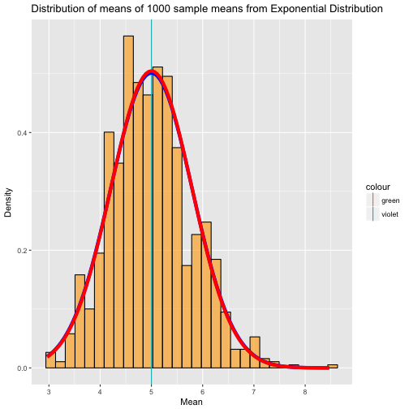

#Synopsis
This report is for Statistical Inference course on Coursera. The project contains two parts:  
* Simulation Exercise  
* Basic Inferential Data Analysis  

#Part I: Simulation  
## Overview
In this project I will investigate the exponential distribution in R and compare it with the Central Limit Theorem. The exponential distribution can be simulated in R with <span style = "color: red"> rexp(n, lambda) </span> where lambda is the rate parameter. The mean of exponential distribution is 1/lambda and the standard deviation is also 1/lambda.  

For the project, I will use <span style = "color: red"> lambda = 0.2  </span> for all of the simulations to investigate the distribution of averages of <span style = "color: red"> 40  </span> exponentials in <span style = "color: red"> 1000 </span> simulations.  

## Illustration
Illustrate via simulation and associated explanatory text the properties of the distribution of the mean of 40 exponentials. I will  
1. Show the sample mean and compare it to the theoretical mean of the distribution.  
2. Show how variable the sample is (via variance) and compare it to the theoretical variance of the distribution.  
3. Show that the distribution is approximately normal.  

* Loading libraries and prepare the data 

```r
library(knitr)
library(matrixStats)
library(ggplot2)
size <- 40  #set up sample size to be 40 for 40 exponentials 
lambda <- 0.2  #set up the lambda of 0.2 to be the rate parameter
n <- 1000  #set up the number of simulations to be 1000 times
set.seed(100)  #set up the seed for the reproducible research purpose
data <- matrix(rexp(size * n, rate = lambda), n)  #set up the 1000-times simulated 40 exponentials
data_mean <- rowMeans(data)  #calculate the means of each simulation for all 1000 simulated datasets
```

* Mean Comparison

```r
x_bar <- mean(data_mean)  # sample mean from 1000 simuatled datasets
mu <- 1/lambda  #theoratical mean in exponential distribution
```
The calculated sample mean of 1000 simulated datasets of exponential distributions is 4.9997019 and the theoratical population mean of the exponential distribution is 5. The mean of the sample means and the theoretical mean (expected mean) are very close.

* Variance Comparison

```r
s_vars <- var(data_mean)  #calculate the variances of 1000 sample means for all 1000 simulated datasets
sigma <- (1/lambda)^2/size  #theoratical variance in exponential distribution
```
The calculated sample variance of 1000 simulated datasets of exponential distributions is 0.6335302 and the theoratical population variance of the exponential distribution is 0.625. The variance of the sample means and the theoretical variance (expected variance) are very close too.

* Normal Distribution Approximation

```r
gdata <- data.frame(data_mean)
m <- ggplot(gdata, aes(x = data_mean))
m <- m + geom_histogram(aes(y = ..density..), colour = "black", 
    fill = "orange", alpha = 0.6)
m + labs(title = "Distribution of means of 1000 sample means from Exponential Distribution", 
    x = "Mean", y = "Density") + geom_vline(aes(xintercept = x_bar, 
    colour = "green")) + geom_vline(aes(xintercept = mu, colour = "violet")) + 
    stat_function(fun = dnorm, args = list(mean = x_bar, sd = sqrt(s_vars)), 
        color = "blue", size = 2) + stat_function(fun = dnorm, 
    args = list(mean = mu, sd = sqrt(sigma)), colour = "red", 
    size = 2)
```



The density of the actual data is shown by histogram in orange. The theoretical mean and the sample mean are so close that they overlap each other. The red bell curve is formed by the the theoretical mean and theoratical standard deviation while other curve is formed by the sample mean and standard deviation. The distribution of averages of 40 exponential distributions is close to the normal distribution with the expected theoretical values based on the given lambda.  

## Conclusion
It is obvious that the distribution of sample means indeed demonstrates the Central Limit Theorem. After the mean and variance comparisons, the sample means of simulated exponential distribution is approximately normal distribution.  

