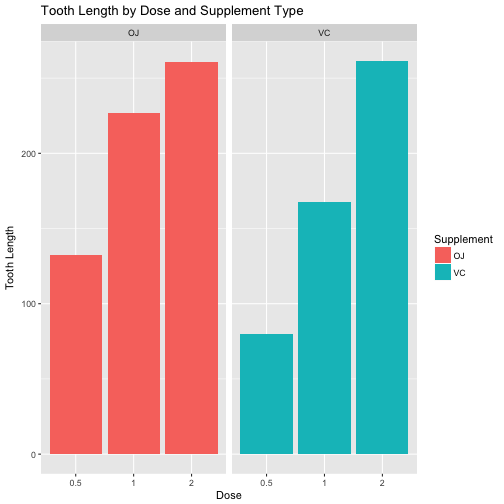

#Synopsis
This report is for Statistical Inference course on Coursera. The project contains two parts:  
* Simulation Exercise  
* Basic Inferential Data Analysis  


#Part II: Tooth Growth Data Analysis  
## Overview
In the project, I will analyze the tooth growth dataset in R dataset package. 

## Illustration
1. Load the ToothGrowth data and perform some basic exploratory data analyses.  
2. Provide a basic summary of the data.  
3. Use confidence intervals and/or hypothesis tests to compare tooth growth by supp and dose.
4. State your conclusions and the assumptions needed for your conclusions.  

* Loading the data and basic exploratory data analysis

```r
library(knitr)
library(doBy)
library(ggplot2)
str(ToothGrowth)
```

```
## 'data.frame':	60 obs. of  3 variables:
##  $ len : num  4.2 11.5 7.3 5.8 6.4 10 11.2 11.2 5.2 7 ...
##  $ supp: Factor w/ 2 levels "OJ","VC": 2 2 2 2 2 2 2 2 2 2 ...
##  $ dose: num  0.5 0.5 0.5 0.5 0.5 0.5 0.5 0.5 0.5 0.5 ...
```

```r
n1 <- length(unique(ToothGrowth$len))
n2 <- length(unique(ToothGrowth$dose))
```
From struction function, we can know that there are 3 variables and 60 observations in Tooth Growth dataset:  
*len*: numeric variable with 43 distinct values.  
*supp*: factor variable with 2 distinct values **OJ** and **VC**.  
*dose*: numeric variable with 3 distinct values.  

```r
ggplot(data = ToothGrowth, aes(x = as.factor(dose), y = len, 
    fill = supp)) + geom_bar(stat = "identity") + facet_grid(. ~ 
    supp) + xlab("Dose") + ylab("Tooth Length") + ggtitle("Tooth Length by Dose and Supplement Type") + 
    guides(fill = guide_legend(title = "Supplement"))
```



Here is the plot of the tooth lengths by different doses and supplement types.  

* Summary of data

```r
summary(ToothGrowth)
```

```
##       len        supp         dose      
##  Min.   : 4.20   OJ:30   Min.   :0.500  
##  1st Qu.:13.07   VC:30   1st Qu.:0.500  
##  Median :19.25           Median :1.000  
##  Mean   :18.81           Mean   :1.167  
##  3rd Qu.:25.27           3rd Qu.:2.000  
##  Max.   :33.90           Max.   :2.000
```
Variable len ranges from 4.2 to 33.90 with an overall mean of 18.81 and variable dose ranges from 0.5 to 2 with an overall mean of 1.167.  
By supp groups, we can get a summary as follow:

```r
summaryBy(len ~ supp, data = ToothGrowth, FUN = c(mean, sd))
```

```
##   supp len.mean   len.sd
## 1   OJ 20.66333 6.605561
## 2   VC 16.96333 8.266029
```

```r
summaryBy(len ~ dose, data = ToothGrowth, FUN = c(mean, sd))
```

```
##   dose len.mean   len.sd
## 1  0.5   10.605 4.499763
## 2  1.0   19.735 4.415436
## 3  2.0   26.100 3.774150
```
It looks that the lens are different due to different supplement or dose We will need to find out if the difference is significant with 0.05 significance level by hypothesis test.  

* Hypothesis Test  
Use t.test to determine if there is a significant difference in the performance of the treatments. First, we will run the test based on supplement.

```r
t.test(ToothGrowth$len[ToothGrowth$supp == "OJ"], ToothGrowth$len[ToothGrowth$supp == 
    "VC"], paired = FALSE, var.equal = FALSE)
```

```
## 
## 	Welch Two Sample t-test
## 
## data:  ToothGrowth$len[ToothGrowth$supp == "OJ"] and ToothGrowth$len[ToothGrowth$supp == "VC"]
## t = 1.9153, df = 55.309, p-value = 0.06063
## alternative hypothesis: true difference in means is not equal to 0
## 95 percent confidence interval:
##  -0.1710156  7.5710156
## sample estimates:
## mean of x mean of y 
##  20.66333  16.96333
```
The p-value in the t test is 0.06063 and 95% Confidence Interval is (-0.1710156  7.5710156). The p-value is bigger than 0.05 and the 95% CI contains 0, which means the difference is not significant at alpha = 0.05.  

Now we take a look at the differences between different doses. I will conduct a pairwise multiple test using BH method.

```r
pairwise.t.test(ToothGrowth$len, ToothGrowth$dose, p.adjust.method = "BH", 
    paired = FALSE, alternative = "two.sided")
```

```
## 
## 	Pairwise comparisons using t tests with pooled SD 
## 
## data:  ToothGrowth$len and ToothGrowth$dose 
## 
##   0.5     1      
## 1 1.0e-08 -      
## 2 4.4e-16 1.4e-05
## 
## P value adjustment method: BH
```
From the summary table, we can tell for each pair of doses (0.5,1), (0.5,2), (1,2), the p-values are all less than 0.05. Thus, we can conclude that by using method of BH, the doses of 0.5, 1 and 2 mg are significant from each other.   

## Assumptions and conclusion
* By supplement type  
Ho: There is no difference of tooth length between using orange juice and VC.  
Ha: There is difference of tooth length between using orange juice and VC.  
Conclusion: The p-value between using orange juice and VC is 0.06, which is larger than 0.05. Thus, we can't reject the assumption that there is no difference of tooth length between using orange juice and VC.  

* By doses  
Ho: There is no difference of tooth length among doses of 0.5, 1 and 2mg.  
Ha: There is difference of tooth length among doses of 0.5, 1 and 2mg.  
Conclusion: The p-values among doses of 0.5, 1 and 2mg pairwised are all less than 0.05. Thus, we must reject the assumption that there is no difference of tooth length among doses of 0.5, 1 and 2mg.
